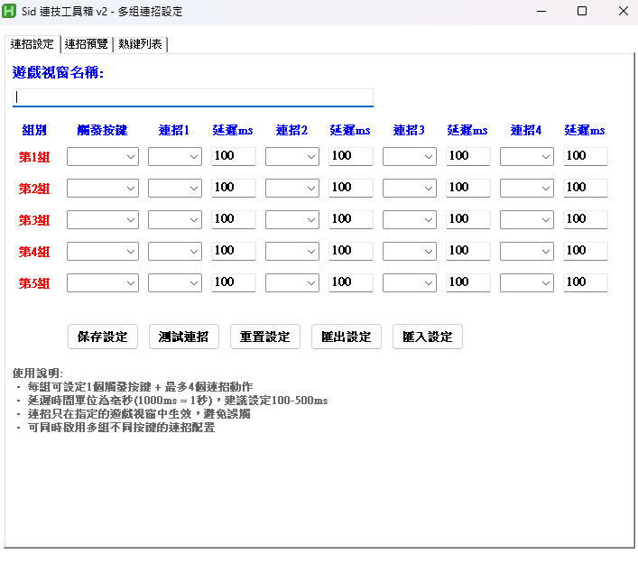

# Sid 技能連段工具箱 (Sid Combo Toolbox)

一個基於 **AutoHotkey v2** 的遊戲技能連段工具，支援自訂技能連段、GUI 操作介面與多組配置切換。  
A game **combo automation tool** written in AutoHotkey v2, allowing custom skill sequences with an intuitive GUI and multiple combo sets.

---

## ✨ 功能特色 (Features)

- 🎮 **多組技能連段**：支援 5 組連段設定，可隨時切換  
- 🖥 **GUI 介面**：直覺操作，不需修改程式碼  
- ⌨️ **快捷鍵觸發**：一鍵施放完整技能組合  
- ⚙️ **彈性配置**：自由編輯技能按鍵與延遲時間  
- 📋 **視窗鎖定**：可指定遊戲視窗，避免誤觸  

---

## 📦 安裝 (Installation)

1. 下載並安裝 [AutoHotkey v2](https://www.autohotkey.com/)  
2. 將 `Sid技能連段工具箱.ahk` 放到任意資料夾  
3. 直接雙擊執行 `.ahk` 腳本  
4. GUI 會顯示在桌面，可開始編輯連段  

---

## 🚀 使用方法 (Usage)

1. 啟動腳本後，會出現 **技能連段設定視窗**  
2. 在 GUI 輸入需要的技能按鍵 (例如 `Q E R`) 與延遲 (毫秒)  
3. 設定完成後，可透過快捷鍵觸發對應連段
   
---

---

## ⌨️ 預設快捷鍵 (Default Hotkeys)

| 功能 (Function)      | 快捷鍵 (Hotkey) |
|----------------------|-----------------|
| 啟用/停用 腳本      | `F1`            |
| 鎖定/解鎖 視窗      | `F2`            |
| 執行第 1 組連段    | `1`             |
| 執行第 2 組連段    | `2`             |
| 執行第 3 組連段    | `3`             |
| 執行第 4 組連段    | `4`             |
| 執行第 5 組連段    | `5`             |

*(可在 GUI 或程式碼內自由修改)*

---

## ⚠️ 注意事項 (Notes)

- 本工具僅供學習與個人用途，請勿用於影響遊戲公平性的行為  
- 需保持遊戲視窗在前台或使用 **視窗鎖定功能**  
- 若快捷鍵與遊戲衝突，建議重新設定  

---

## 📜 授權 (License)

此專案採用 [MIT License](LICENSE)  
自由使用、修改與分享，但請保留原作者 Sid 的署名  

---

## 🌐 作者 (Author)

- 👤 Sid  
- 🔗 GitHub: [Sid-1996](https://github.com/Sid-1996)
